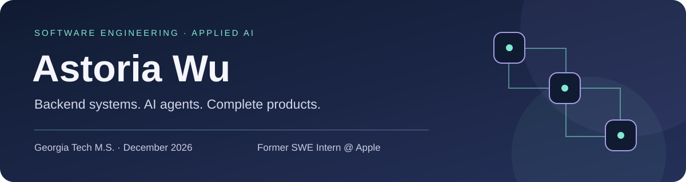
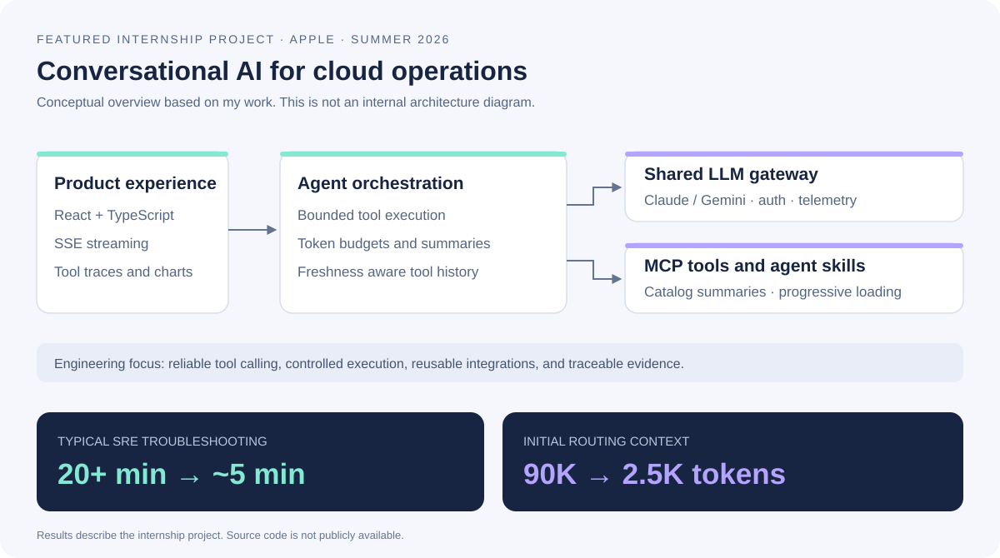

I build backend systems and AI applications. I work mainly with Java, and I also build React and TypeScript interfaces.

I'm completing my M.S. at Georgia Tech in December 2026. I'm looking for opportunities in **backend, full stack, and applied AI engineering**.

## Featured project: Conversational AI for Cloud Operations

**Apple · Software Engineering Intern · May to August 2026**

I built an internal AI product that helps SREs troubleshoot cloud issues through conversation. It connects LLMs with operational tools and runbooks. Engineers can follow tool execution, inspect the evidence, and view results as charts.

I worked across the Java backend, agent orchestration, model integrations, context management, and React frontend.

### What I built

| Area | My work |
| :--- | :--- |
| Reusable AI foundation | Separated a shared LLM gateway from conversational agent orchestration. Centralized Claude and Gemini routing, authentication, and token and latency telemetry. New AI workflows could reuse provider integrations. |
| Bounded agent runtime | Implemented tool execution limits and graceful completion when an agent reaches its budget. Added controls for tool access and retries of operations that change state. |
| MCP and skill routing | Used catalog summaries and progressive loading to select tools and skills without loading every schema and instruction upfront. Also supported direct user skill selection. |
| Context management | Combined token budgets, conversation summaries, and timestamped tool history. The agent could reuse valid results and refresh evidence that was no longer current. |
| Product experience | Built React and TypeScript interfaces with SSE streaming, skill cards, visible tool traces, and schema validated Recharts visualizations. |
| Reliability | Resolved streaming, session state, and persistence failures that caused lost, duplicated, or reordered responses. |

**Results:** Typical SRE troubleshooting fell from **20+ minutes to about 5 minutes**. Initial routing context fell from **about 90K to 2.5K tokens**, a **97% reduction**.

**Stack:** Java · Guice · React · TypeScript · PostgreSQL · JDBI · Flyway · REST · SSE · Protobuf · MCP · Claude and Gemini APIs

*This was an internal Apple project. Source code is not publicly available. The illustration is a conceptual summary of my work.*

## Public projects

### [Order Management System](https://github.com/aw520/order-management-system)

A backend application with separate user, product, and order services. Each service owns its database. Kafka coordinates order validation and inventory updates.

I implemented transactional inventory checks, idempotency keys, and persisted response snapshots to prevent overselling and duplicate stock changes. Authentication uses RS256 JWTs, role based access, and Redis backed refresh token rotation.

I deployed the services to AWS ECS with RDS, ElastiCache, and MSK, automated image publishing with GitHub Actions, and wrote 55 tests.

**Stack:** Java · Spring Boot · Kafka · MySQL · Redis · Docker · AWS

### [Stock Headline Analysis](https://github.com/22pilarskil/StockHeadlineAnalysis)

A team coursework project exploring stock movement classification using news headlines and numerical market data. The project includes BERT, attention mechanisms, and Transformer models.

**Stack:** Python · PyTorch · TensorFlow · Transformers · Pandas · scikit-learn

### [Shopping Cart Application](https://github.com/aw520/shopping-cart-application)

A React application for browsing products and managing a shopping cart. It includes quantity controls, live totals, and pagination that preserves page position in the URL.

**Stack:** React · Redux Toolkit · Axios · React Router · Vite

### [Video Transcription and Sentiment Analysis](https://github.com/aw520/AI_Driving_Sim_Analysis)

A Python tool for analyzing communication in human and AI driving simulator experiments. It transcribes video, groups speech into five second intervals, and exports sentiment analysis results and visualizations.

**Stack:** Python · Whisper · NLTK · Pandas · Matplotlib · FFmpeg

## Education and coursework

### Georgia Institute of Technology

**M.S. in Computational Science and Engineering · Expected December 2026 · GPA: 4.0/4.0**

Selected completed coursework:

| Focus | Courses |
| :--- | :--- |
| Software and algorithms | Database Systems Concepts and Design; Computational Science and Engineering Algorithms |
| AI and machine learning | Artificial Intelligence; Deep Learning; Scientific Machine Learning; Computational Data Analysis |
| Scientific computing | Computational Problem Solving; Numerical Linear Algebra; Modeling and Simulation: Foundations and Implementation |

### Imperial College London

**MSci in Mathematics · First Class Honours · 2024**

Selected completed coursework:

| Focus | Courses |
| :--- | :--- |
| Programming and discrete mathematics | Principles of Programming; Introduction to Computation; Graph Theory; Mathematical Logic |
| Learning and optimization | Methods for Data Science; Introduction to Statistical Learning; Optimisation |
| Computational mathematics | Computational Linear Algebra; Scientific Computation; Numerical Solution of Ordinary Differential Equations |
| Probability and statistics | Applied Probability; Probability for Statistics; Statistical Theory |

## Technologies

**Backend:** Java · Spring Boot · Guice · REST APIs · PostgreSQL · MySQL · Redis · Kafka  
**AI systems:** LLM APIs · MCP · Tool calling · Agent orchestration · Context management  
**Frontend:** React · TypeScript · Redux · SSE · Recharts  
**Infrastructure:** AWS · Docker · Kubernetes · GitHub Actions

## Get in touch

[fwu88@gatech.edu](mailto:fwu88@gatech.edu)
